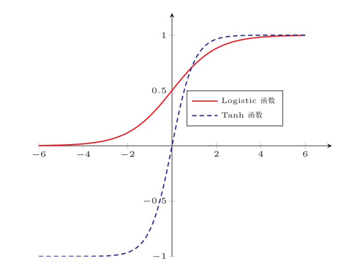
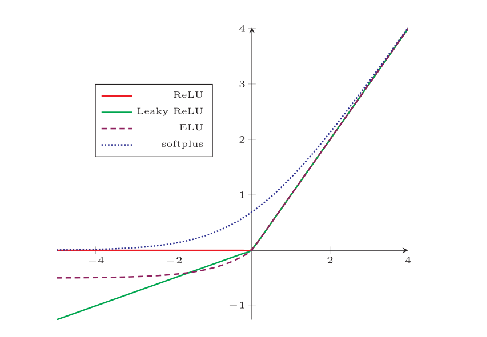
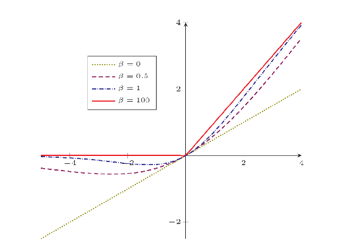

# 激活函数

[TOC]

## 1. 激活函数的作用

1. 引入非线性因素的，解决线性模型所不能解决的问题（形象解释：https://zhuanlan.zhihu.com/p/25279356）
2. 可以把当前特征空间通过一定的线性映射转换到另一个空间，让数据能够更好的被分类。或者说，只要激活函数中有能够泰勒展开的函数，就可能起到特征组合的作用（通俗解释：https://zhuanlan.zhihu.com/p/27661298）

**为什么激活函数需要非线性函数？**

1. 如果网络中全部是线性部件，那么线性的组合还是线性，与单独一个线性分类器无异。这样就做不到用非线性来逼近任意函数。
2. 使用非线性激活函数 ，以便使网络更加强大，增加它的能力，使它可以学习复杂的事物，复杂的表单数据，以及表示输入输出之间非线性的复杂的任意函数映射。使用非线性激活函数，能够从输入输出之间生成非线性映射。

## 2. 激活函数的性质

1. 连续并可导（允许少数点上不可导）的非线性函数。可导的激活函数可以直接利用数值优化的方法来学习网络参数。
2. 激活函数及其导函数要尽可能简单，有利于提高网络计算效率。
3. 激活函数的导函数的值域要在一个合适的区间内，否则会影响训练的效率和稳定性。
4. 单调性，当激活函数是单调的，单层网络能够保证是凸函数。

## 3. 常见激活函数

### Sigmoid 函数与 Tanh 函数

- Sigmoid函数定义：$ Sigmoid(x) = \frac{1}{1 + e^{-x}} $，其值域为 $ (0,1) $。

- Tanh函数定义：$ tanh(x) = \frac{e^x - e^{-x}}{e^x + e^{-x}} $，值域为 $ (-1,1) $。

- 性质：饱和函数（当$x \rightarrow -/+\infty$时, $f'(x) \rightarrow 0$，称其为左/右饱和）

- 优点：

  1. 把输入压缩到一个范围，输出可以直接看作概率分布，使得神经网络可以更好地和统计学习模型进行结合。
  2. 可以看作是一个软性门，用来控制其他神经元输出信息的数量。

- 缺点：

  1. Sigmoid函数，非零中心化的输出会使得Sigmoid函数其后一层的神经元的输入发生偏置偏移（bias shift），并进一步使得梯度下降的收敛速度变慢（Tanh函数的输出是零中心化的）。
  2. Sigmoid函数将输入映射到区间（0，1），当x很大或很小时，导数趋近于0，造成梯度消失。
  3. Tanh函数将输入映射到区间（-1，1），当x很大或很小时，导数趋近于0，造成梯度消失。

- 函数图像：

  

### ReLU 函数

1. ReLU 

   - 函数定义：$ \operatorname{ReLU}(x) = \max(0, x) $  ，值域为 $ [0,+∞) $；
   - 优点：
     1. 采用ReLU的神经元只需要进行加、乘和比较的操作，计算上更高效（从计算的角度上，Sigmoid和Tanh激活函数均需要计算指数，复杂度高，而ReLU只需要一个阈值即可得到激活值）。
     2. 单侧抑制，提供了网络的稀疏表达能力（大约50%的神经元会处于激活状态）。
     3. 稀疏激活性（神经元同时只对输入信号的少部分选择性响应，大量信号被刻意的屏蔽了，这样可以提高学习的精度，更好更快地提取稀疏特征）
     4. 相比Sigmoid函数的两端饱和，ReLU函数为左饱和函数，且在x>0时导数为1，其非饱和性，在一定程度上缓解了神经网络的梯度消失问题，加速梯度下降的收敛速度，提供了相对宽的激活边界
   - 缺点：
     1. ReLU函数的输出时非零中心化的，给后一层的神经网络引入偏置偏移，会影响梯度下降的效率。
     2. 存在死亡ReLU问题：在训练时，如果参数在一次不恰当的更新后，第一个隐藏层中的某个ReLU神经元在所有的训练数据上都不能被激活，那么这个神经元自身参数的梯度永远都会是0，在以后的训练过程中永远不能被激活（负梯度 -> ReLU -> 0）。并且该问题可能也会发生在其他隐藏层。（为了避免这个问题，引申出一些ReLU变种）。在实际训练中，如果学习率设置较大，会导致超过一定比例的神经元不可逆死亡，进而参数梯度无法更新。

2. LReLU (Leaky ReLU, 带泄露的ReLU)

   - 函数定义：$\begin{aligned} \operatorname{LeakyReLU}(x) &= \begin{cases}x & \text { if } x>0 \\ \gamma x & \text { if } x \leq 0\end{cases} =\max (0, x)+\gamma \min (0, x) \end{aligned}$，$\gamma$是一个很小的常数，比如0.01。
   - 优点：在输入x<0时，保持一个很小的常数$\gamma$，这样一来当神经元非激活时也能有一个非零的梯度，可以更新参数，避免永远不能被激活。
   - 缺点：$\gamma$值得选择增加了问题难度，需要较强的人工先验或者多次重复训练来确定合适的参数值。

3. PReLU (Parametric ReLU, 带参数的ReLU)

   - 对于第i个神经元，函数定义：$\mathrm{PReLU}_{i}(x)= \begin{cases}x & \text { if } x>0 \\ \gamma_{i} x & \text { if } x \leq 0\end{cases}$，其中$\gamma_{i} $为$x \leq 0$时函数的斜率。‘
   - 优点：引入一个可学习的参数，让$\gamma$和其他含参数网络层联合优化。此外，允许不同神经元具有不同的参数，也可以一组神经元共享一个参数。

4. ELU

   - 函数定义：$\begin{aligned} \operatorname{ELU}(x) &= \begin{cases}x & \text { if } x>0 \\ \gamma(\exp (x)-1) & \text { if } x \leq 0\end{cases} =\max (0, x)+\min (0, \gamma(\exp (x)-1)) \end{aligned}$，其中$\gamma\ge0$\是一个超参数，决定$x\le0$时的饱和曲线，并调整输出均值在0附近（近似的零中心化的非线性函数）。

   ​

5. Softplus函数（ReLU函数的平滑版本）

   - 函数定义：$\operatorname{Softplus}(x)=\log (1+\exp (x))$
   - Softplus函数的导数是Sigmoid函数，虽然具有单侧抑制、宽兴奋边界的性质，却没有稀疏激活性。

6. 函数图像：

   

### Swish 函数

- 函数定义：$\operatorname{swish}(x)=x \sigma(\beta x)$，其中$\sigma()$为Logistic函数，$\beta$为可学习的或固定的超参数。$\sigma(\beta x)$可以看作是一种软性门控机制。接近于1时门开，激活函数的输出近似于x；接近于0时门关，激活函数的输出近似于0。

- 函数图像：

  

- Swish函数可以看作线性函数和ReLU函数之间的非线性插值函数，其程度由$\beta$控制。

### GELU 函数

- 函数定义：$\operatorname{GELU}(x)=x P(X \leq x)$，其中$P(X ≤ x)$是高斯分布$N(µ,σ 2 )$的累积分布函数（S型函数），其中$µ,σ$为超参数，一般设$µ = 0,σ = 1$即可
- GELU也是一种通过门控机制来调整其输出的激活函数，类似于Swish函数。

### Maxout 单元

- ReLU单元及其扩展都基于一个原则：越接近线性，则模型越容易优化。采用更容易优化的线性，这种一般化的原则也适用于除了深度前馈网络之外的网络。
- Maxout单元是ReLU单元的进一步扩展。Sigmoid、ReLU 等激活函数的输入是神经元的净输入 z，是一个标量。而 Maxout单元的输入是上一层神经元的全部原始输入，是一个向量$x = [x_1; x_2; · · · , x_d]$。
- Maxout单元并不是作用于$\overrightarrow{\mathbf{Z}}$的每个元素 ，而是将$\overrightarrow{\mathbf{Z}}$分成若干个小组（如何分组，没有确定性的指导准则），每个组有k个元素：

$$
\mathbb{G}_{1}=\left\{z_{1}, z_{2}, \cdots, z_{k}\right\} \\
\mathbb{G}_{2}=\left\{z_{k+1}, z_{k+2}, \cdots, z_{2 k}\right\}\\
\vdots\\
\mathbb{G}_{i}=\left\{z_{(i-1) k+1}, z_{(i-1) k+2}, \cdots, z_{i k}\right\}\\
\vdots
$$

- 然后Maxout单元对每个组输出其中最大值的元素：

$$
$g(\overrightarrow{\mathbf{z}})_{i}=\max _{z_{j} \in \mathbb{G}_{i}} z_{j}$
$$

- Maxout 单元的 $\overrightarrow{\mathbf{z}}$ 通常是通过对输入 $\overrightarrow{\mathbf{x}}$ 执行多个仿射变换而来。

- 设 $\overrightarrow{\mathbf{x}}=\left(x_{1}, \cdots, x_{n}\right)^{T} \in \mathbb{R}^{n}$ ， Maxout 单元有 $k$ 个分组，输出为 $y_{1}, \cdots, y_{n}$ :
  $$
  \begin{gathered}
  y_{1}=\max \left(\overrightarrow{\mathbf{w}}_{1,1}^{T} \cdot \overrightarrow{\mathbf{x}}+b_{1,1}, \cdots, \overrightarrow{\mathbf{w}}_{1, k}^{T} \cdot \overrightarrow{\mathbf{x}}+b_{1, k}\right) \\
  \vdots \\
  y_{n}=\max \left(\overrightarrow{\mathbf{w}}_{n, 1}^{T} \cdot \overrightarrow{\mathbf{x}}+b_{n, 1}, \cdots, \overrightarrow{\mathbf{w}}_{n, k}^{T} \cdot \overrightarrow{\mathbf{x}}+b_{n, k}\right)
  \end{gathered}
  $$
  令
  $$
  \begin{array}{r}
  \mathbf{W}_{1}=\left[\begin{array}{c}
  \overrightarrow{\mathbf{w}}_{1,1}^{T} \\
  \overrightarrow{\mathbf{w}}_{2,1}^{T} \\
  \ldots \\
  \overrightarrow{\mathbf{w}}_{n, 1}^{T}
  \end{array}\right] \quad \ldots \quad \mathbf{W}_{k}=\left[\begin{array}{c}
  \overrightarrow{\mathbf{w}}_{1, k}^{T} \\
  \overrightarrow{\mathbf{w}}_{2, k}^{T} \\
  \cdots \\
  \overrightarrow{\mathbf{w}}_{n, k}^{T}
  \end{array}\right] \quad \overrightarrow{\mathbf{b}}_{1}=\left[\begin{array}{c}
  b_{1,1} \\
  b_{2,1} \\
  \cdots \\
  b_{n, 1}
  \end{array}\right] \quad \ldots \quad \overrightarrow{\mathbf{b}}_{k}=\left[\begin{array}{c}
  b_{1, k} \\
  b_{2, k} \\
  \cdots \\
  b_{n, k}
  \end{array}\right] 
  \end{array}\\
  \overrightarrow{\mathbf{y}}=\left[y_{1}, y_{2}, \cdots, y_{n}\right]^{T}
  $$
  则有: $\overrightarrow{\mathbf{y}}=\max \left(\mathbf{W}_{1} \overrightarrow{\mathbf{x}}+\overrightarrow{\mathbf{b}}_{1}, \cdots, \mathbf{W}_{k} \overrightarrow{\mathbf{x}}+\overrightarrow{\mathbf{b}}_{k}\right)​$ 。

- 优点：

  1. 接近线性，模型易于优化
  2. 经过 Maxout 层之后，输出维数降低到输入的$\frac{1}{k}$ ，这意味着下一层的权重参数的数量降低到 Maxout 层的  $\frac{1}{k}$。
  3. 由多个分组驱动，因此具有一些冗余度来抵抗遗忘灾难(catastrophic forgetting)
     - 遗忘灾难指的是：网络忘记了如何执行它们过去已经训练了的任务。

- 在卷积神经网络中， max pooling 层就是由 Maxout 单元组成。

- Maxout 单元提供了一种方法来学习输入空间中的多维度线性分段函数。它可以学习具有k段的线性分段的凸函数，因此 Maxout 单元也可以视作学习激活函数本身。

- 使用足够大的 k， Maxout 单元能够以任意程度逼近任何凸函数。

  - 特别的，$k=2$ 时的 Maxout 单元组成的隐层可以学习实现传统激活函数的隐层相同的功能，包括：ReLU 函数、绝对值修正线性激活函数、LReLU函数、PReLU函数，也可以学习不同于这些函数的其他函数。
  - 注意： maxout层的参数化与ReLU层等等这些层不同（最典型的，maxout层的输出向量的维数发生变化），因此即使maxout层实现了ReLU函数，其学习机制也不同。

### Softmax 函数 TODO

函数定义为： $ \sigma(z)_j = \frac{e^{z_j}}{\sum_{k=1}^K e^{z_k}} $。

Softmax 多用于多分类神经网络输出。

## 4. 常见激活函数的导数

| 激活函数    | 表达式                       | 导数                                       | 备注                                       |
| :------ | ------------------------- | ---------------------------------------- | ---------------------------------------- |
| Sigmoid | $f(x)=\frac{1}{1+e^{-x}}$ | $f^{'}(x)=\frac{1}{1+e^{-x}}\left( 1- \frac{1}{1+e^{-x}} \right)=f(x)(1-f(x))$ | 当$x=10$, $x=-10$，$f^{'}(x) \approx0$；当$x=0$, $f^{'}(x) =0.25$ |
| Tanh    | $f(x)=\frac{1}{1+e^{-x}}$ | $f^{'}(x)=-(tanh(x))^2$                  | 当$x=10$, $x=-10$，$f^{'}(x) \approx0$；当$x=0$, $f^{`}(x) =1$ |
| ReLU    | $f(x)=max(0,x)$           | $c(u)=\begin{cases} 0,x<0 \\ 1,x>0 \\ undefined,x=0\end{cases}$ | 通常$x=0$时，给定其导数为1和0                       |

## 5. 在循环神经网络中能否使用ReLU作为激活函数？ 

可以，但是需要将W初始化为单位矩阵。当采用ReLU作为循环神经网络中隐含层的激活函数时，只有当W的取值在单位矩阵附近时才能取得比较好的效果。实验证明，初始化W为单位矩阵并使用ReLU激活函数在一些应用中取得了与LSTM相似的结果，并且学习速度比长短期记忆模型更快。 

## Reference

Books

1. 葫芦娃, 百面机器学习[M]. 北京: 人民邮电出版社, 2018.
2. 邱锡鹏, 神经网络与深度学习[M]. 北京: 机械工业出版社, 2020.

Github

1. https://github.com/scutan90/DeepLearning-500-questions

其他

1. 忆臻, 形象的解释神经网络激活函数的作用是什么, https://zhuanlan.zhihu.com/p/25279356
2. 忆臻, 通俗理解激活函数作用的另一种解释, https://zhuanlan.zhihu.com/p/27661298
3. 华校专, http://www.huaxiaozhuan.com/%E6%B7%B1%E5%BA%A6%E5%AD%A6%E4%B9%A0/chapters/1_deep_forward.html